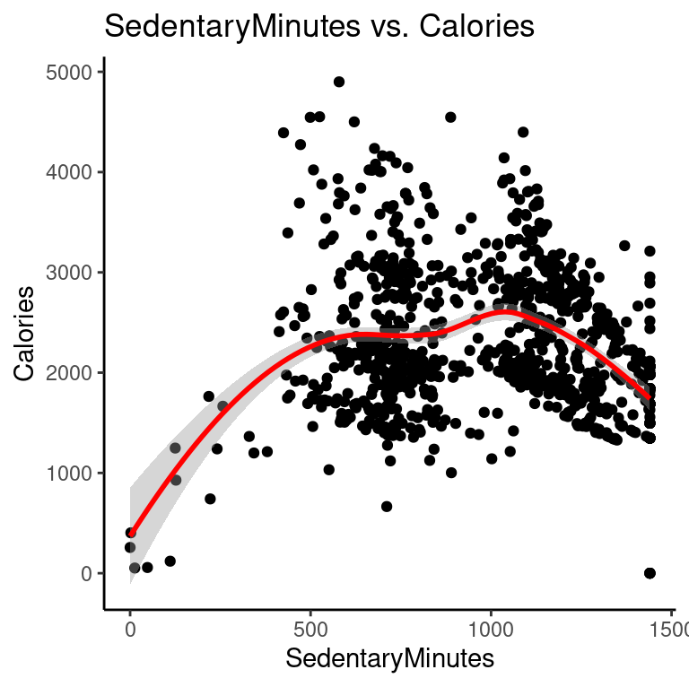
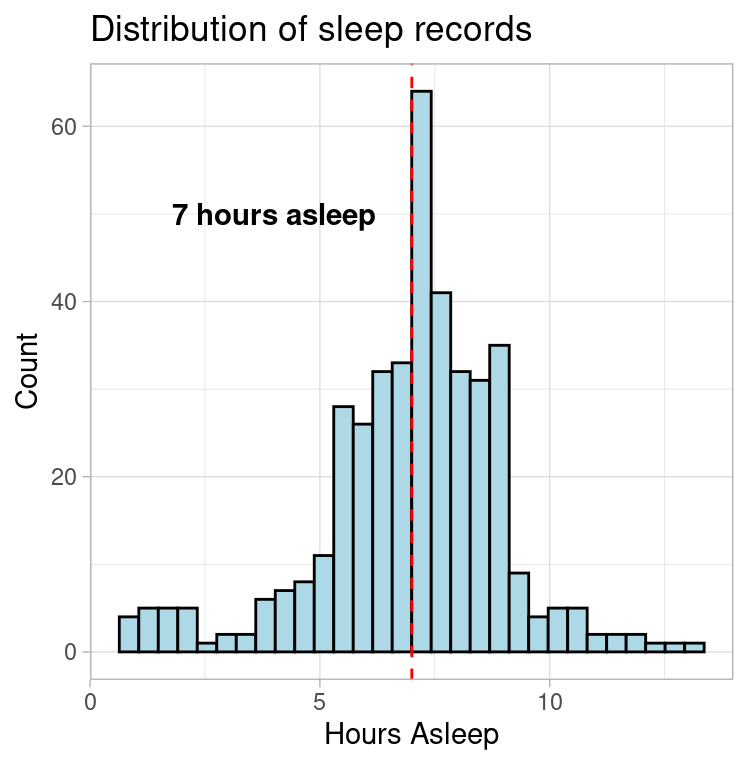

# Bellabeat-Case-Study

### Table of Contents
1. Introduction
2. Background
3. Scenario
4. Ask
5. Prepare
6. Process
7. Analyze
8. Share
9. Act

## 1. Introduction 

In this project I will be examining the Bellabeat Wellness Technology Case Study which is a capstone project for the Google Data Analytics Professional Certificate. I will examine this case study and address key business questions using the different steps I learned from the course including; to ask, prepare, process, analyze, share and act.

## 2. Background

Founded in 2013 by Urška Sršen and Sando Mur, Bellabeat is a high-tech company that specializes in manufacturing health-focused products designed to interact with one another for women. Bellabeat's products collect data on activity, sleep, stress, and reproductive health, empowering women with knowledge about their own health and habits. Since its inception, Bellabeat has quickly grown into a leading tech-driven wellness company for women. By 2016, Bellabeat had expanded its operations, opening offices worldwide and launching multiple products available on its company website and through various online retailers. 

Bellabeat offers a vast array of products, including the Bellabeat app which provides users with health data related to their activity, sleep, stress, menstrual cycle, and mindfulness habits. Their product line also features the Leaf, a versatile wellness tracker that can be worn as a bracelet, necklace, or clip; the Time, a wellness watch combining classic aesthetics with smart technology to track activity, sleep, and stress; and finally, the Spring, a smart water bottle that tracks daily water intake. These smart technology options can all connect, enabling data-driven insights. In addition, Bellabeat provides a subscription-based membership program offering 24/7 access to fully personalized guidance on nutrition, activity, sleep, health and beauty, and mindfulness, tailored to individual lifestyles and goals. 

## 3. Scenario 

In this hypothetical case study I am working as a junior data analyst working on the marketing analyst team at Bellabeat and will be presenting my findings as well as possible solutions to the Bellabeat executive team. My report will specifically entail a clear statement on the business task, a description of data used, documentation of cleaning or manipulation of data, a summary of analysis, supporting visualizations and my top recommendations based on the analysis.

## 4. Ask

## 5. Prepare

```r
# Install and load necessary packages
install.packages("tidyverse")
library(tidyverse)
install.packages("ggplot2")
library(ggplot2)
install.packages("scales")
library(scales)
install.packages("dplyr")
library(dplyr)
install.packages("tidyr")
library(tidyr)

# Import datasets
daily_activity <- read.csv("dailyActivity_merged.csv")
daily_calories <- read.csv("dailyCalories_merged.csv")
daily_intensities <- read.csv("dailyIntensities_merged.csv")
daily_steps <- read.csv("dailySteps_merged.csv")
sleep <- read.csv("sleepDay_merged.csv")
hourly_intensities <- read.csv("hourlyIntensities_merged.csv")
hourly_steps <- read.csv("hourlySteps_merged.csv")
```

## 6. Process:

```r
# Cleaning and Formatting
daily_activity$Ymd <- as.Date( daily_activity$ActivityDate, format=" %m/%d/%Y")
str(daily_activity)

daily_steps$Ymd <- as.Date(daily_steps$ActivityDay, format=" %m/%d/%Y")
str(daily_steps)

daily_intensities$Ymd <- as.Date(daily_intensities$ActivityDay, format=" %m/%d/%Y")
str(daily_intensities)

daily_calories$Ymd <- as.Date(daily_calories$ActivityDay, format=" %m/%d/%Y")
str(daily_calories)

sleep$Ymd <- as.Date(sleep$SleepDay, format=" %m/%d/%Y")
str(sleep)

hourly_intensities$ActivityHour=as.POSIXct(hourly_intensities$ActivityHour, format="%m/%d/%Y %I:%M:%S %p", tz=Sys.timezone())
hourly_intensities$time <- format(hourly_intensities$ActivityHour, format = "%H:%M:%S")
hourly_intensities$date <- format(hourly_intensities$ActivityHour, format = "%m/%d/%y")
str(hourly_intensities)

hourly_steps$ActivityHour=as.POSIXct(hourly_steps$ActivityHour, format="%m/%d/%Y %I:%M:%S %p", tz=Sys.timezone())
hourly_steps$time <- format(hourly_steps$ActivityHour, format = "%H:%M:%S")
hourly_steps$date <- format(hourly_steps$ActivityHour, format = "%m/%d/%y")
str(hourly_steps)

# Verify the number of participants
n_distinct(daily_activity$Id)
n_distinct(daily_calories$Id)
n_distinct(daily_intensities$Id)
n_distinct(daily_steps$Id)
n_distinct(sleep$Id)
n_distinct(hourly_intensities$Id)
n_distinct(hourly_steps$Id)

# Look for any duplicates and remove them
sum(duplicated(daily_activity))
sum(duplicated(daily_calories))
sum(duplicated(daily_intensities))
sum(duplicated(daily_steps))
sum(duplicated(sleep))
sum(duplicated(hourly_intensities))
sum(duplicated(hourly_steps))

sleep <- sleep %>% # Remove duplicates
  distinct() %>%
  drop_na()

# Merge datasets sleep and daily activity
colnames(daily_activity) <- gsub("\\s", "", colnames(daily_activity))
colnames(sleep) <- gsub("\\s", "", colnames(sleep))

merged_data <- merge(sleep, daily_activity, by = "Id")
glimpse(merged_data)
```

## 7. Analyze

### Analysis of Activity

```r
daily_activity %>% # the total number of variables
   select(TotalSteps, TotalDistance, SedentaryMinutes, Calories) %>%
   summary()
   TotalSteps    TotalDistance    SedentaryMinutes    Calories   
 Min.   :    0   Min.   : 0.000   Min.   :   0.0   Min.   :   0  
 1st Qu.: 3790   1st Qu.: 2.620   1st Qu.: 729.8   1st Qu.:1828  
 Median : 7406   Median : 5.245   Median :1057.5   Median :2134  
 Mean   : 7638   Mean   : 5.490   Mean   : 991.2   Mean   :2304  
 3rd Qu.:10727   3rd Qu.: 7.713   3rd Qu.:1229.5   3rd Qu.:2793  
 Max.   :36019   Max.   :28.030   Max.   :1440.0   Max.   :4900 
```

#### Interesting Findings:
- The average person takes 7.638 steps a day, which is less than the reccomended average of 10,000 by the American Heart Association.
- Average calorie consumption is 2304.
- The average particiapnts sendtary time is 991 minutes which is equivalent to rougly 16 hours.

```r
daily_activity_hours <- daily_activity %>% # the number of active hours per category
   mutate(SedentaryHours = round(SedentaryMinutes / 60, 1),
          VeryActiveHours = round(VeryActiveMinutes / 60, 1),
          FairlyActiveHours = round(FairlyActiveMinutes / 60, 1),
          LightActiveHours = round(LightlyActiveMinutes / 60, 1)) %>%
   select(SedentaryHours, VeryActiveHours, FairlyActiveHours, LightActiveHours)
 summary(daily_activity_hours)
 SedentaryHours  VeryActiveHours  FairlyActiveHours LightActiveHours
 Min.   : 0.00   Min.   :0.0000   Min.   :0.000     Min.   :0.000   
 1st Qu.:12.20   1st Qu.:0.0000   1st Qu.:0.000     1st Qu.:2.100   
 Median :17.60   Median :0.1000   Median :0.100     Median :3.300   
 Mean   :16.52   Mean   :0.3498   Mean   :0.223     Mean   :3.214   
 3rd Qu.:20.50   3rd Qu.:0.5000   3rd Qu.:0.300     3rd Qu.:4.400   
 Max.   :24.00   Max.   :3.5000   Max.   :2.400     Max.   :8.600  

 daily_activity %>% # the number of active minutes per category
   select(VeryActiveMinutes, FairlyActiveMinutes, LightlyActiveMinutes) %>%
   summary()
 VeryActiveMinutes FairlyActiveMinutes LightlyActiveMinutes
 Min.   :  0.00    Min.   :  0.00      Min.   :  0.0       
 1st Qu.:  0.00    1st Qu.:  0.00      1st Qu.:127.0       
 Median :  4.00    Median :  6.00      Median :199.0       
 Mean   : 21.16    Mean   : 13.56      Mean   :192.8       
 3rd Qu.: 32.00    3rd Qu.: 19.00      3rd Qu.:264.0       
 Max.   :210.00    Max.   :143.00      Max.   :518.0  
```

#### Interesting Findings:
- The majority of particiapants are lightly active when not sedentary while slighty more particiaptns are very activite as opposed to fairly active.

### Analysis of Sleep
```r
 sleep %>%
   select(TotalSleepRecords, TotalMinutesAsleep, TotalTimeInBed) %>%
   summary()
 TotalSleepRecords TotalMinutesAsleep TotalTimeInBed 
 Min.   :1.00      Min.   : 58.0      Min.   : 61.0  
 1st Qu.:1.00      1st Qu.:361.0      1st Qu.:403.8  
 Median :1.00      Median :432.5      Median :463.0  
 Mean   :1.12      Mean   :419.2      Mean   :458.5  
 3rd Qu.:1.00      3rd Qu.:490.0      3rd Qu.:526.0  
 Max.   :3.00      Max.   :796.0      Max.   :961.0 

 sleep_hours <- sleep %>%
   mutate(TotalHoursAsleep = round (TotalMinutesAsleep / 60, 1),
          TotalHoursInBed = round(sleep$TotalTimeInBed / 60, 1)) %>%
   select(TotalHoursAsleep, TotalHoursInBed)
 summary(sleep_hours)
 TotalHoursAsleep TotalHoursInBed 
 Min.   : 1.000   Min.   : 1.000  
 1st Qu.: 6.000   1st Qu.: 6.725  
 Median : 7.200   Median : 7.700  
 Mean   : 6.987   Mean   : 7.639  
 3rd Qu.: 8.200   3rd Qu.: 8.800  
 Max.   :13.300   Max.   :16.000 
```
#### Interesting Findings:
- On average, each participant slept roughly over 7 hours.

## 8. Share

### Total Steps vs. Calories

```r
#Total Steps vs. Calories
ggplot(data=daily_activity, aes(x=TotalSteps, y=Calories)) + 
  geom_point() + geom_smooth(color = "red") +
  labs(title="Total Steps vs. Calories") +
  theme_classic()
```


There is a positive correlation between the number of steps taken and the number of calories burned. 

### Total Steps vs. Minutes Asleep

```r
#Total Steps vs. Minutes Asleep
ggplot(data = merged_data, aes(x = TotalSteps, y = TotalMinutesAsleep)) +
  geom_jitter() +
  geom_smooth(color="red") +
  labs(title = "Total Steps vs. Minutes Asleep", x = "Total Steps", y = "Minutes Asleep") +
  theme_classic()
```


There is no correlation between user's daily steps and the amount of minutes spent asleep per day. 

### Activity vs. Calories (Sedentary)

```r
#Activity vs Calories (Sedentary)
ggplot(data=daily_activity, aes(x=SedentaryMinutes, y=Calories)) + 
  geom_point() + geom_smooth(color = "red") +
  labs(title="SedentaryMinutes vs. Calories") +
  theme_classic()
```



There is a negative correlatipon between Sentaery minutes and carlories burned.

### Activity vs. Calories (Lightyly Active)

```r
#Activity vs Calories (Lightly Active)
ggplot(data=daily_activity, aes(x=LightlyActiveMinutes, y=Calories)) + 
  geom_point() + geom_smooth(color = "red") +
  labs(title="LightlyActiveMinutes vs. Calories") +
  theme_classic()
```


There is very slight positive corerlation between lightly actvie minutes and calories burned. 

### Activity vs Calories (Fairly Active)

```r
#Activity vs Calories (Fairly Active)
ggplot(data=daily_activity, aes(x=FairlyActiveMinutes, y=Calories)) + 
  geom_point() + geom_smooth(color = "red") +
  labs(title="FairlyActiveMinutes vs. Calories") +
  theme_classic()
```


There is neither a positive or negative correlation between farily active minutes and calories burned. 

### Activity vs Calories (Very Active)

```r
#Activity vs Calories (Very Active)
ggplot(data=daily_activity, aes(x=VeryActiveMinutes, y=Calories)) + 
  geom_point() + geom_smooth(color = "red") +
  labs(title="VeryActiveMinutes vs. Calories") +
  theme_classic()
```
 


There is the highest positive correlation between very active minutes and calories burned.

### Sleep distribution

```r
#Sleep distribution
ggplot(data = sleep_hours) +
  geom_histogram(
    mapping = aes(x = TotalHoursAsleep), color="black", fill="lightblue",
    bins = 30, show.legend = FALSE) +
  labs(title = "Distribution of sleep records", x = 'Hours Asleep', y = "Count") +
  geom_vline(aes(xintercept=7), linetype = "dashed", color = "red") +
  annotate("text", x=4, y=50, label="7 hours asleep", fontface = "bold", color = "black") +
  theme_light()
```


### Daily usage of smart devices

```r
# Daily usage of smart devices
daily_activity$total_time = rowSums(daily_activity[c("VeryActiveMinutes", "FairlyActiveMinutes", "LightlyActiveMinutes","SedentaryMinutes")])

daily_activity %>% 
  group_by(Id) %>% 
  summarise(daily_usage_hours = mean(total_time/60)) %>% 
  
  ggplot() + 
  geom_histogram(mapping = aes(x=daily_usage_hours), color = "black", fill = "lightblue", 
                 bins = 30, show.legend=FALSE) +
  labs(title="Average App Usage Time (Hours)", x = "App Usage Time")+
  theme_light()
```

### Frequency of smart device use

```r
#Frequency of smart device use
daily_usage <- daily_activity %>%
  group_by(Id) %>%
  summarise(daily_usage_hours = mean(total_time / 60)) %>%
  mutate(usage = if_else(daily_usage_hours >= 17, "high", "low"))

daily_usage %>%
  count(usage) %>%
  mutate(percentage = n * 100 / sum(n)) %>%
  ggplot(aes(x = "", y = percentage, fill = usage)) +
  geom_bar(stat = "identity", width = 1) +
  coord_polar("y", start = 0) +
  geom_text(aes(label = round(percentage)), position = position_stack(vjust = 0.5)) +
  scale_fill_manual(values = c("lightblue", "pink"),
                    labels = c("High use: > 17 hours", "Low use: < 17 hours")) +
  labs(title = "Percentage frequency of daily usage level of device") +
  theme_void()
```
### Average Hourly Intensity

```r
#Average Hourly Intensity
hourly_intensities %>%
  group_by(time) %>%
  summarise(Avg_hourly_int = mean(TotalIntensity)) %>%
  
  ggplot(aes(x = time, y = Avg_hourly_int)) +
  geom_histogram(aes(fill= Avg_hourly_int), stat="identity")+ 
  scale_fill_gradient(low = "yellow", high = "lightgreen") +
  theme_light()+ 
  theme(axis.text.x = element_text(angle = 90)) +
  labs(title = "Average Total Intensity vs. Time", x= "Time", y="Mean Total Intensity")
```

### Average Hourly Steps

```r
#Average Hourly Steps
hourly_steps %>%
  group_by(time) %>%
  summarise(Avg_hourly_steps = mean(StepTotal)) %>%
  
  ggplot(aes(x = time, y = Avg_hourly_steps)) +
  geom_histogram(aes(fill = Avg_hourly_steps), stat = "identity") +
  scale_fill_gradient(low = "pink", high = "lightblue") +
  theme_light() +
  theme(axis.text.x = element_text(angle = 90)) +
  labs(title = "Average Steps Hourly", x="Activity Hour", y="Mean Total Steps")
```

## 9. Act:


