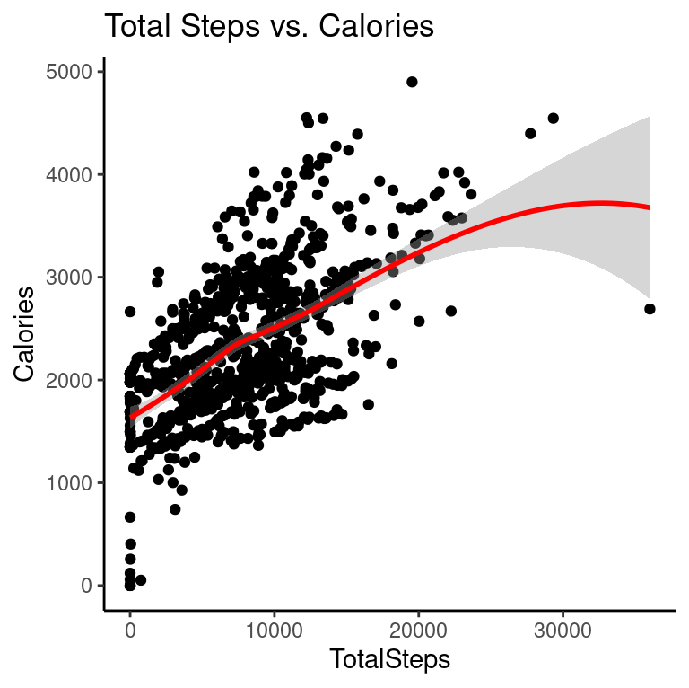
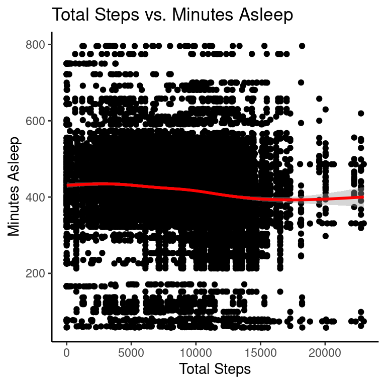
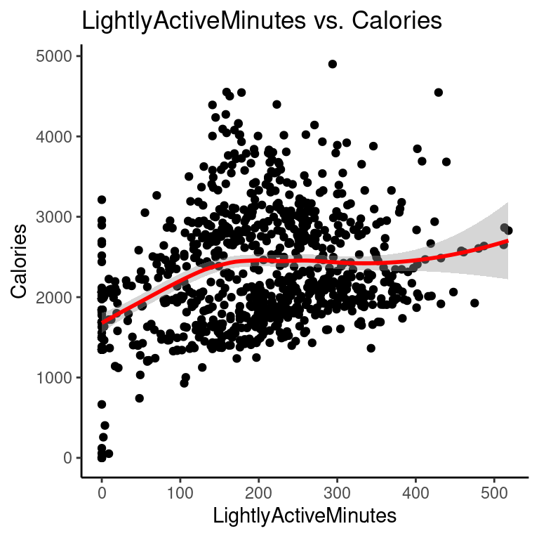
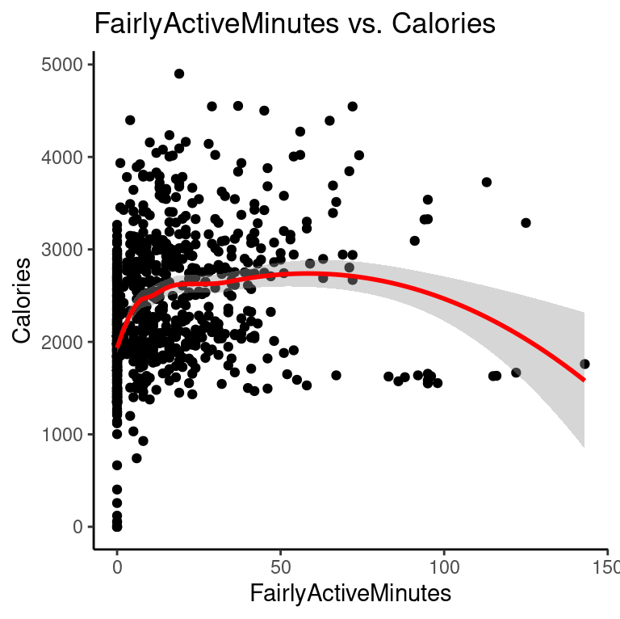
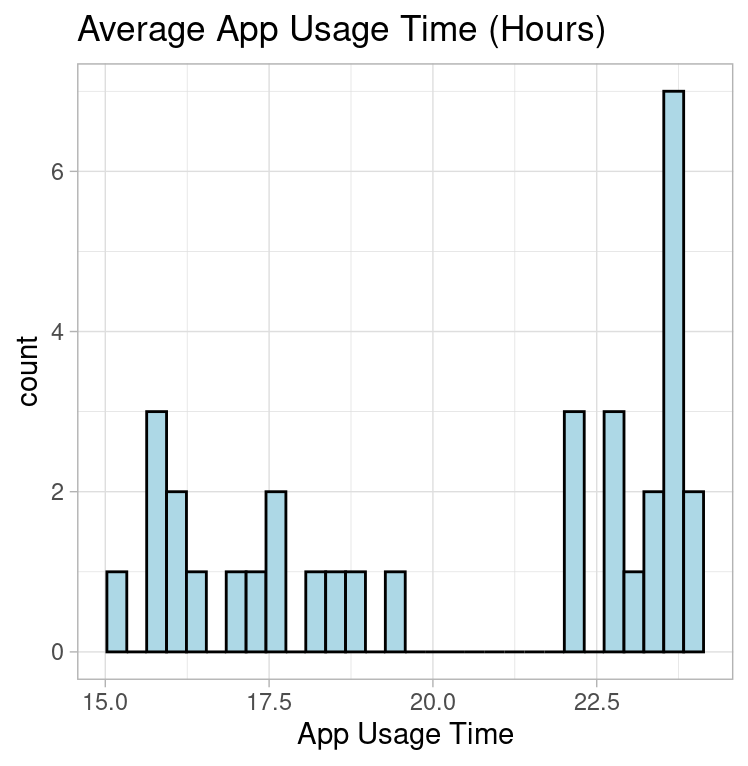
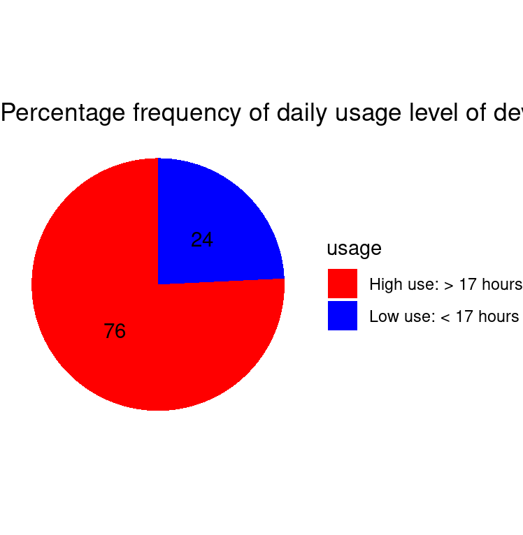
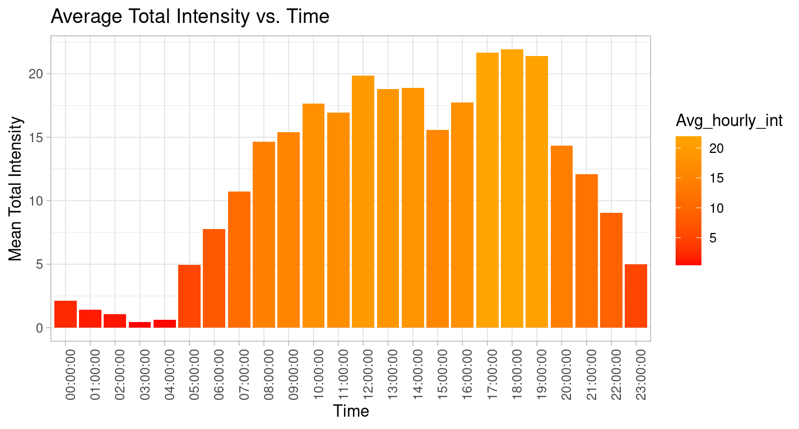
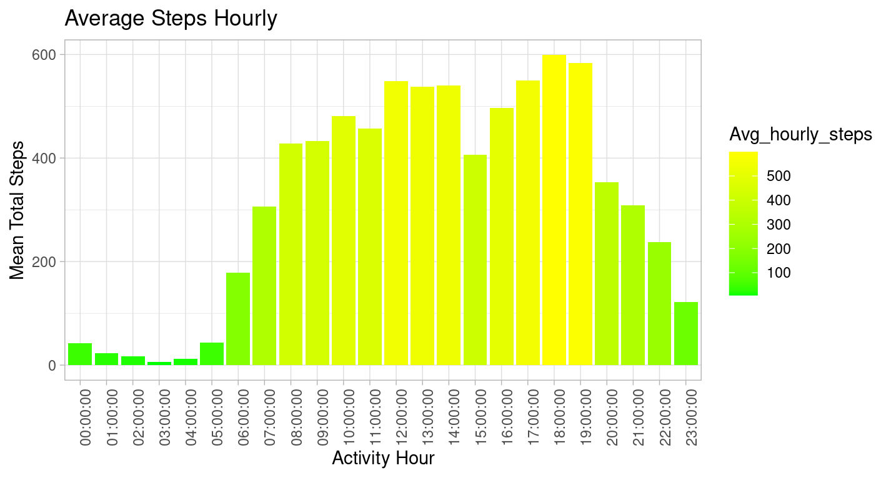

-# Bellabeat-Case-Study

### Table of Contents
1. Introduction
2. Background
3. Scenario
4. Ask
5. Prepare
6. Process
7. Analyze
8. Share
9. Act

## 1. Introduction 

This project analyzes the Bellabeat Wellness Technology Case Study, a capstone project for the Google Data Analytics Professional Certificate. I will address key business questions using the six-step data analysis process: Ask, Prepare, Process, Analyze, Share, and Act.

## 2. Background

Founded in 2013 by Urška Sršen and Sando Mur, Bellabeat is a high-tech company that specializes in manufacturing health-focused products designed to interact with one another for women. Bellabeat's products collect data on activity, sleep, stress, and reproductive health, empowering women with knowledge about their own health and habits. Since its inception, Bellabeat has quickly grown into a leading tech-driven wellness company for women. By 2016, Bellabeat had expanded its operations, opening offices worldwide and launching multiple products available on its company website and through various online retailers. 

Bellabeat offers a vast array of products, including the Bellabeat app which provides users with health data related to their activity, sleep, stress, menstrual cycle, and mindfulness habits. Their product line also features the Leaf, a versatile wellness tracker that can be worn as a bracelet, necklace, or clip; the Time, a wellness watch combining classic aesthetics with smart technology to track activity, sleep, and stress; and finally, the Spring, a smart water bottle that tracks daily water intake. These smart technology options can all connect, enabling data-driven insights. In addition, Bellabeat provides a subscription-based membership program offering 24/7 access to fully personalized guidance on nutrition, activity, sleep, health and beauty, and mindfulness, tailored to individual lifestyles and goals. 

## 3. Scenario 

In this hypothetical case study I am working as a junior data analyst working on the marketing analyst team at Bellabeat and will be presenting my findings as well as possible solutions to the Bellabeat executive team. My report will specifically entail a clear statement on the business task, a description of data used, documentation of cleaning or manipulation of data, a summary of analysis, supporting visualizations and my top recommendations based on the analysis.

## 4. Ask

The business task is to analyze Bellabeat's data to understand how consumer usage patterns differ among active and inactive users. By identifying key trends in usage, I will provide data-driven recommendations to the Bellabeat executive team on how to optimize marketing strategies to increase user engagement and drive business growth.

To ensure the validity of my analysis, I will evaluate the provided dataset against the ROCCC framework to verify that the data is reliable, original, comprehensive, current, and cited.

## 5. Prepare

### Data Source

To ensure the validity of my analysis, I will evaluate the provided dataset against the ROCCC framework to verify that the data is reliable, original, comprehensive, current, and cited."
The data for this project is a public dataset from Kaggle, specifically from the Mobius user profile, which was generated by responses to a survey conducted on Amazon Mechanical Turk. It contains personal health data from 30 consensual Fitbit users, including daily activity, steps, heart rate, and sleep monitoring.

To evaluate the data's suitability, I applied the ROCCC framework. The data's reliability is a concern due to the small sample size, which is insufficient to accurately reflect the broader population of female Fitbit users. Its originality is also limited as it was collected by a third party. Furthermore, the dataset is not comprehensive since it lacks key demographic information like age and gender, and it is not current, with responses collected from March to May 2016. However, the data is a strong point, as it is well-cited and documented, which provides a level of trustworthiness. Despite these limitations, the data contains enough relevant health information to address the business questions. After this initial assessment, I prepared the data for analysis in RStudio."

```r
# Install and load necessary packages
install.packages("tidyverse")
library(tidyverse)
install.packages("ggplot2")
library(ggplot2)
install.packages("scales")
library(scales)
install.packages("dplyr")
library(dplyr)
install.packages("tidyr")
library(tidyr)

# Import datasets
daily_activity <- read.csv("dailyActivity_merged.csv")
daily_calories <- read.csv("dailyCalories_merged.csv")
daily_intensities <- read.csv("dailyIntensities_merged.csv")
daily_steps <- read.csv("dailySteps_merged.csv")
sleep <- read.csv("sleepDay_merged.csv")
hourly_intensities <- read.csv("hourlyIntensities_merged.csv")
hourly_steps <- read.csv("hourlySteps_merged.csv")
```

## 6. Process:

```r
# Cleaning and Formatting
daily_activity$Ymd <- as.Date( daily_activity$ActivityDate, format=" %m/%d/%Y")
str(daily_activity)

daily_steps$Ymd <- as.Date(daily_steps$ActivityDay, format=" %m/%d/%Y")
str(daily_steps)

daily_intensities$Ymd <- as.Date(daily_intensities$ActivityDay, format=" %m/%d/%Y")
str(daily_intensities)

daily_calories$Ymd <- as.Date(daily_calories$ActivityDay, format=" %m/%d/%Y")
str(daily_calories)

sleep$Ymd <- as.Date(sleep$SleepDay, format=" %m/%d/%Y")
str(sleep)

hourly_intensities$ActivityHour=as.POSIXct(hourly_intensities$ActivityHour, format="%m/%d/%Y %I:%M:%S %p", tz=Sys.timezone())
hourly_intensities$time <- format(hourly_intensities$ActivityHour, format = "%H:%M:%S")
hourly_intensities$date <- format(hourly_intensities$ActivityHour, format = "%m/%d/%y")
str(hourly_intensities)

hourly_steps$ActivityHour=as.POSIXct(hourly_steps$ActivityHour, format="%m/%d/%Y %I:%M:%S %p", tz=Sys.timezone())
hourly_steps$time <- format(hourly_steps$ActivityHour, format = "%H:%M:%S")
hourly_steps$date <- format(hourly_steps$ActivityHour, format = "%m/%d/%y")
str(hourly_steps)

# Verify the number of participants
n_distinct(daily_activity$Id)
n_distinct(daily_calories$Id)
n_distinct(daily_intensities$Id)
n_distinct(daily_steps$Id)
n_distinct(sleep$Id)
n_distinct(hourly_intensities$Id)
n_distinct(hourly_steps$Id)

# Look for any duplicates and remove them
sum(duplicated(daily_activity))
sum(duplicated(daily_calories))
sum(duplicated(daily_intensities))
sum(duplicated(daily_steps))
sum(duplicated(sleep))
sum(duplicated(hourly_intensities))
sum(duplicated(hourly_steps))

sleep <- sleep %>% # Remove duplicates
  distinct() %>%
  drop_na()

# Merge datasets sleep and daily activity
colnames(daily_activity) <- gsub("\\s", "", colnames(daily_activity))
colnames(sleep) <- gsub("\\s", "", colnames(sleep))

merged_data <- merge(sleep, daily_activity, by = "Id")
glimpse(merged_data)
```

## 7. Analyze

### Analysis of Activity

```r
daily_activity %>% # the total number of variables
   select(TotalSteps, TotalDistance, SedentaryMinutes, Calories) %>%
   summary()
   TotalSteps    TotalDistance    SedentaryMinutes    Calories   
 Min.   :    0   Min.   : 0.000   Min.   :   0.0   Min.   :   0  
 1st Qu.: 3790   1st Qu.: 2.620   1st Qu.: 729.8   1st Qu.:1828  
 Median : 7406   Median : 5.245   Median :1057.5   Median :2134  
 Mean   : 7638   Mean   : 5.490   Mean   : 991.2   Mean   :2304  
 3rd Qu.:10727   3rd Qu.: 7.713   3rd Qu.:1229.5   3rd Qu.:2793  
 Max.   :36019   Max.   :28.030   Max.   :1440.0   Max.   :4900 
```

#### Interesting Findings:
- The average person takes 7.638 steps a day, which is less than the recommended average of 10,000 by the American Heart Association.
- Average calorie consumption is 2304.
- The average participant's sedentary time is 991 minutes which is equivalent to roughly 16 hours.

```r
daily_activity_hours <- daily_activity %>% # the number of active hours per category
   mutate(SedentaryHours = round(SedentaryMinutes / 60, 1),
          VeryActiveHours = round(VeryActiveMinutes / 60, 1),
          FairlyActiveHours = round(FairlyActiveMinutes / 60, 1),
          LightActiveHours = round(LightlyActiveMinutes / 60, 1)) %>%
   select(SedentaryHours, VeryActiveHours, FairlyActiveHours, LightActiveHours)
 summary(daily_activity_hours)
 SedentaryHours  VeryActiveHours  FairlyActiveHours LightActiveHours
 Min.   : 0.00   Min.   :0.0000   Min.   :0.000     Min.   :0.000   
 1st Qu.:12.20   1st Qu.:0.0000   1st Qu.:0.000     1st Qu.:2.100   
 Median :17.60   Median :0.1000   Median :0.100     Median :3.300   
 Mean   :16.52   Mean   :0.3498   Mean   :0.223     Mean   :3.214   
 3rd Qu.:20.50   3rd Qu.:0.5000   3rd Qu.:0.300     3rd Qu.:4.400   
 Max.   :24.00   Max.   :3.5000   Max.   :2.400     Max.   :8.600  

 daily_activity %>% # the number of active minutes per category
   select(VeryActiveMinutes, FairlyActiveMinutes, LightlyActiveMinutes) %>%
   summary()
 VeryActiveMinutes FairlyActiveMinutes LightlyActiveMinutes
 Min.   :  0.00    Min.   :  0.00      Min.   :  0.0       
 1st Qu.:  0.00    1st Qu.:  0.00      1st Qu.:127.0       
 Median :  4.00    Median :  6.00      Median :199.0       
 Mean   : 21.16    Mean   : 13.56      Mean   :192.8       
 3rd Qu.: 32.00    3rd Qu.: 19.00      3rd Qu.:264.0       
 Max.   :210.00    Max.   :143.00      Max.   :518.0  
```

#### Interesting Findings:
- The majority of participants are lightly active when not sedentary while slightly more participants are very active as opposed to fairly active.

### Analysis of Sleep
```r
 sleep %>%
   select(TotalSleepRecords, TotalMinutesAsleep, TotalTimeInBed) %>%
   summary()
 TotalSleepRecords TotalMinutesAsleep TotalTimeInBed 
 Min.   :1.00      Min.   : 58.0      Min.   : 61.0  
 1st Qu.:1.00      1st Qu.:361.0      1st Qu.:403.8  
 Median :1.00      Median :432.5      Median :463.0  
 Mean   :1.12      Mean   :419.2      Mean   :458.5  
 3rd Qu.:1.00      3rd Qu.:490.0      3rd Qu.:526.0  
 Max.   :3.00      Max.   :796.0      Max.   :961.0 

 sleep_hours <- sleep %>%
   mutate(TotalHoursAsleep = round (TotalMinutesAsleep / 60, 1),
          TotalHoursInBed = round(sleep$TotalTimeInBed / 60, 1)) %>%
   select(TotalHoursAsleep, TotalHoursInBed)
 summary(sleep_hours)
 TotalHoursAsleep TotalHoursInBed 
 Min.   : 1.000   Min.   : 1.000  
 1st Qu.: 6.000   1st Qu.: 6.725  
 Median : 7.200   Median : 7.700  
 Mean   : 6.987   Mean   : 7.639  
 3rd Qu.: 8.200   3rd Qu.: 8.800  
 Max.   :13.300   Max.   :16.000 
```
#### Interesting Findings:
- On average, each participant slept roughly over 7 hours.

### Total Steps vs. Calories

```r
#Total Steps vs. Calories
ggplot(data=daily_activity, aes(x=TotalSteps, y=Calories)) + 
  geom_point() + geom_smooth(color = "red") +
  labs(title="Total Steps vs. Calories") +
  theme_classic()
```



#### Interesting Findings:
- There is a positive correlation between the number of steps taken and the number of calories burned. 

### Total Steps vs. Minutes Asleep

```r
#Total Steps vs. Minutes Asleep
ggplot(data = merged_data, aes(x = TotalSteps, y = TotalMinutesAsleep)) +
  geom_jitter() +
  geom_smooth(color="red") +
  labs(title = "Total Steps vs. Minutes Asleep", x = "Total Steps", y = "Minutes Asleep") +
  theme_classic()
```


#### Interesting Findings:
- There is no correlation between the user's daily steps and the amount of minutes spent asleep per day. 

### Activity vs. Calories (Sedentary)

```r
#Activity vs Calories (Sedentary)
ggplot(data=daily_activity, aes(x=SedentaryMinutes, y=Calories)) + 
  geom_point() + geom_smooth(color = "red") +
  labs(title="SedentaryMinutes vs. Calories") +
  theme_classic()
```


#### Interesting Findings:
- There is a negative correlation between Sedentary minutes and calories burned.

### Activity vs. Calories (Lightyly Active)

```r
#Activity vs Calories (Lightly Active)
ggplot(data=daily_activity, aes(x=LightlyActiveMinutes, y=Calories)) + 
  geom_point() + geom_smooth(color = "red") +
  labs(title="LightlyActiveMinutes vs. Calories") +
  theme_classic()
```


#### Interesting Findings:
- There is a very slight positive correlation between lightly active minutes and calories burned.
  
### Activity vs Calories (Fairly Active)

```r
#Activity vs Calories (Fairly Active)
ggplot(data=daily_activity, aes(x=FairlyActiveMinutes, y=Calories)) + 
  geom_point() + geom_smooth(color = "red") +
  labs(title="FairlyActiveMinutes vs. Calories") +
  theme_classic()
```



#### Interesting Findings:
- There is neither a positive or negative correlation between fairly active minutes and calories burned. 

### Activity vs Calories (Very Active)

```r
#Activity vs Calories (Very Active)
ggplot(data=daily_activity, aes(x=VeryActiveMinutes, y=Calories)) + 
  geom_point() + geom_smooth(color = "red") +
  labs(title="VeryActiveMinutes vs. Calories") +
  theme_classic()
```
 


#### Interesting Findings:
- There is the highest positive correlation between very active minutes and calories burned.

### Sleep distribution

```r
#Sleep distribution
ggplot(data = sleep_hours) +
  geom_histogram(
    mapping = aes(x = TotalHoursAsleep), color="black", fill="lightblue",
    bins = 30, show.legend = FALSE) +
  labs(title = "Distribution of sleep records", x = 'Hours Asleep', y = "Count") +
  geom_vline(aes(xintercept=7), linetype = "dashed", color = "red") +
  annotate("text", x=4, y=50, label="7 hours asleep", fontface = "bold", color = "black") +
  theme_light()
```


#### Interesting Findings:
- This visualization shows that participants get on average 7 hours of sleep while most range from 6 to 9 hours. 

### Daily usage of smart devices

```r
# Daily usage of smart devices
daily_activity$total_time = rowSums(daily_activity[c("VeryActiveMinutes", "FairlyActiveMinutes", "LightlyActiveMinutes","SedentaryMinutes")])

daily_activity %>% 
  group_by(Id) %>% 
  summarise(daily_usage_hours = mean(total_time/60)) %>% 
  
  ggplot() + 
  geom_histogram(mapping = aes(x=daily_usage_hours), color = "black", fill = "lightblue", 
                 bins = 30, show.legend=FALSE) +
  labs(title="Average App Usage Time (Hours)", x = "App Usage Time")+
  theme_light()
```


#### Interesting Findings:
- According to this visualization participants wear their smart devices almost all day including during sleep. 

### Frequency of smart device use

```r
# Frequency of smart device use
daily_usage <- daily_activity %>%
  group_by(Id) %>%
  summarise(daily_usage_hours = mean(total_time / 60)) %>%
  mutate(usage = if_else(daily_usage_hours >= 17, "high", "low"))

daily_usage %>%
  count(usage) %>%
  mutate(percentage = n * 100 / sum(n)) %>%
  ggplot(aes(x = "", y = percentage, fill = usage)) +
  geom_bar(stat = "identity", width = 1) +
  coord_polar("y", start = 0) +
  geom_text(aes(label = round(percentage)), position = position_stack(vjust = 0.5)) +
  scale_fill_manual(values = c("red", "blue"),
                    labels = c("High use: > 17 hours", "Low use: < 17 hours")) +
  labs(title = "Percentage frequency of daily usage level of device") +
  theme_void() 
```



#### Interesting Findings:
- The pie chart illustrates that 76 percent of participants wear their smart devices while 24 do not. 

### Average Hourly Intensity

```r
#Average Hourly Intensity
hourly_intensities %>%
  group_by(time) %>%
  summarise(Avg_hourly_int = mean(TotalIntensity)) %>%
  
  ggplot(aes(x = time, y = Avg_hourly_int)) +
  geom_histogram(aes(fill= Avg_hourly_int), stat="identity")+ 
  scale_fill_gradient(low = "red", high = "orange") +
  theme_light()+
  theme(axis.text.x = element_text(angle = 90)) +
  labs(title = "Average Total Intensity vs. Time", x= "Time", y="Mean Total Intensity")
```



#### Interesting Findings:
- This visualization shows that most participants are most active between 6am and 10pm and the peak intensity occurs from 5pm-7pm.

### Average Hourly Steps

```r
# Average Hourly Steps
hourly_steps %>%
  group_by(time) %>%
  summarise(Avg_hourly_steps = mean(StepTotal)) %>%
  
  ggplot(aes(x = time, y = Avg_hourly_steps)) +
  geom_histogram(aes(fill = Avg_hourly_steps), stat = "identity") +
  scale_fill_gradient(low = "green", high = "yellow") +
  theme_light() +
  theme(axis.text.x = element_text(angle = 90)) +
  labs(title = "Average Steps Hourly", x="Activity Hour", y="Mean Total Steps")
```



#### Interesting Findings:
- This visualization shows that most participants are taking the most steps between 6am and 10pm and the peak steps occurs from 5pm-7pm.

## 8. Share

Below is a link to my Google Slides presentation of the case study:

## 9. Act:

### Key Takeaways
- Averages Ballebeat app users walk more than 7,600 steps per day.
- Average calorie consumption among participants is 2304 per day. 
- 24% of participants do not wear devices almost all day.
- Users sleep less roughly over 7 hours per day while most range from 6 to 9 hours.
- The average participant's sedentary time is 991 minutes which is equivalent to roughly 16 hours per day.
- The majority of participants are lightly active when not sedentary while slightly more participants are very active as opposed to fairly active.
- There is a positive correlation between the number of steps taken and the number of calories burned.
- There is no correlation between the user's daily steps and the amount of minutes spent asleep per day.
- There is a negative correlation between Sedentary minutes and calories burned.
- There is a very slight positive correlation between lightly active minutes and calories burned.
- There is neither a positive or negative correlation between fairly active minutes and calories burned.
- There is the highest positive correlation between very active minutes and calories burned.
- Participants wear their smart devices almost all day including during sleep. 
- Most participants are most active and take the most steps between 6am and 10pm and the peak intensity occurs from 5pm-7pm.

### Reccomednations
-Promote the 10,000-Step Goal
  -To increase user engagement and promote healthy habits, I recommend that Bellabeat encourage users to meet the American Heart Association's recommended 10,000-step daily goal. This can be achieved through a multi-faceted approach:
    -In-app reminders that provide a friendly nudge when a user has not reached their daily goal.
    -Educational content in the app's feed, such as articles and infographics, explaining the health benefits of reaching this milestone.
-Optimize Reminders for Peak Activity Hours
  -My analysis of the data revealed that user activity and step count are highest between 5 PM and 7 PM. I recommend that Bellabeat leverage this insight by sending friendly reminders and motivational notifications during this window to help users achieve their goals. This strategy capitalizes on a period when users are already most likely to be active.
- Implement a Reward-Based Promotion
  -To drive user retention and encourage the use of all Bellabeat devices, I recommend a tiered membership discount program. This promotion would provide a discount on Bellabeat's subscription membership to customers who burn a certain number of calories per week, as tracked by their devices. This provides a direct incentive for users to:
    -Engage in regular physical activity.
    -Consistently use their Bellabeat devices to track their workouts.

### Conclusion
In order to find out how Bellabeat customers use and do not use their Bellabeat smart products I conducted an analysis using the data of 30 Bellebeat fit bit users. The goal is to illustrate how women use the Bellabeat app and smart devices throughout the day in order to create niche marketing strategies to reach potential customers. The strategies included using daily notifications to remind users to continue to try to reach the daily step recommendation or to start working out in general and would be most effective during 5-7 when customers are at peak activity. Finally I also recommend that Bellabeat provide a promotion that gives membership discounts to customers that burn a certain amount of calories giving incentive to workout, promote healthy habits and use their Bellabeat smart devices. 
 


